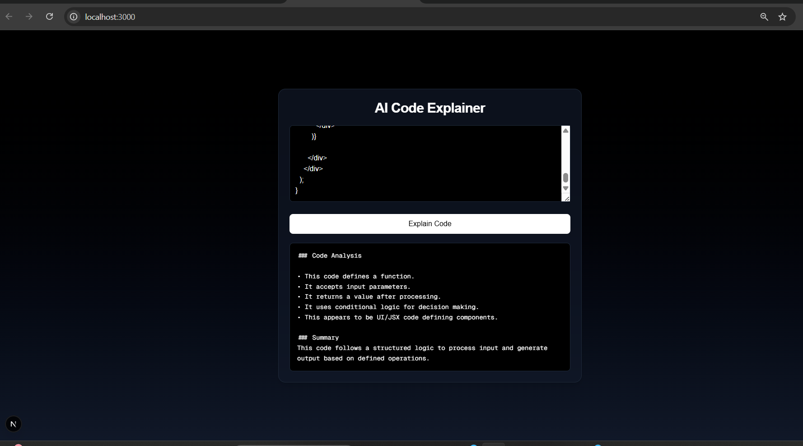

# AI Code Explainer

A simple tool that analyzes code and provides structured explanations based on patterns.

## Features
- Detects functions, loops, conditions
- Structured explanation output
- Clean UI

## Tech Stack
- Next.js
- Tailwind CSS

## Demo

### Generated Output

